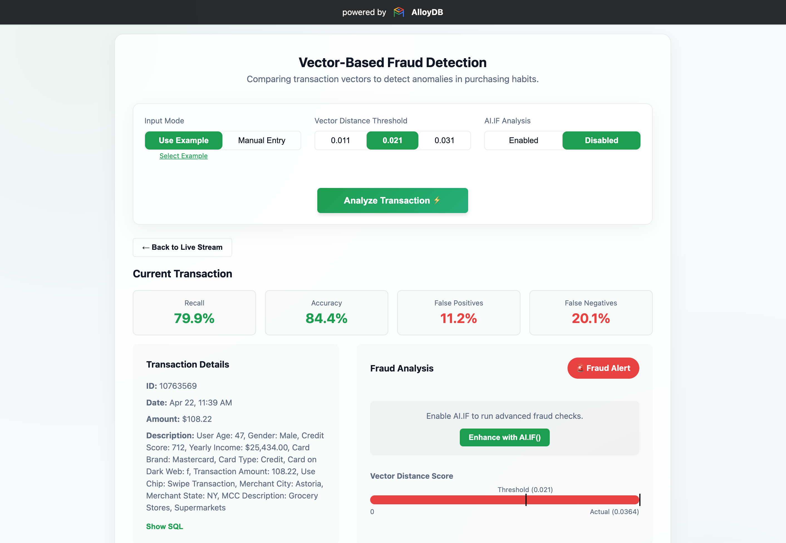
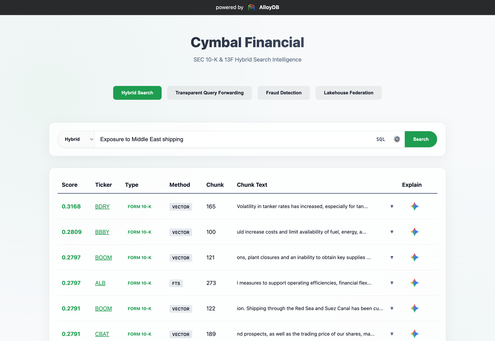
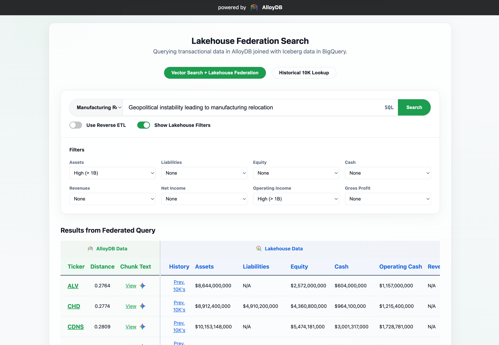
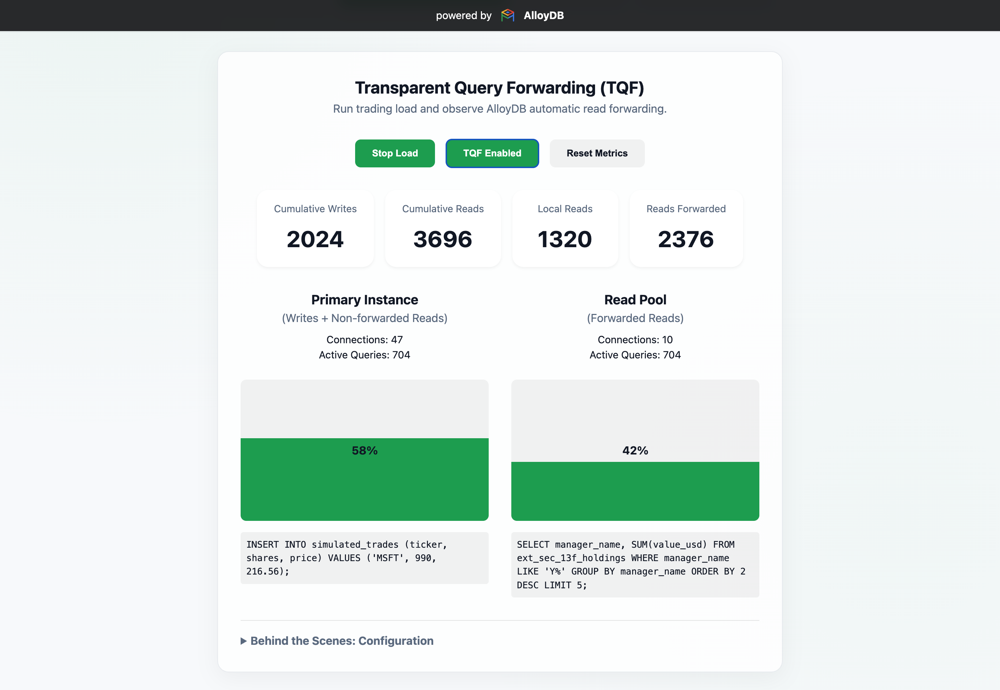

# AlloyDB Demo - Cymbal Financial Services 

This repository contains Terraform code to deploy a fully configured **Google Cloud AlloyDB** environment and a complete **Financial Services Demo Application**. The demo showcases a financial platform for a fictional investment firm, **Cymbal Investments**. It demonstrates several new advanced AlloyDB capabilities launched at Google Cloud Next '26, including:

*   **Transparent Query Forwarding (TQF)**: Automatically reroutes expensive read queries from the primary instance to the read pool without application code changes, ensuring read-after-write consistency and low latency for mission-critical writes.
*   **Lakehouse Federation**: Unifies live transactional data with historical archives in BigQuery and Apache Iceberg (parquet), allowing direct queries across the entire data platform through a single lens.
*   **Hybrid Search**: Combines keyword precision with semantic depth using Google's ScaNN algorithm and Supercharged HNSW with Columnar Engine acceleration, scaling up to 10B+ vectors. Supports native GIN indexing, the RUM extension for full-text performance, and future native BM25. Provides seamless reranking with Reciprocal Rank Fusion (RRF) and Vertex AI models (or bring your own model).
*   **Real-Time Fraud Detection**: Leverages vector search for anomaly detection in high-velocity transaction streams and enhances recall with Gemini's reasoning via the `ai.if()` function.

## Screenshots

Here is a preview of what you will see when you deploy and run the demo application. Click to expand images.

| Fraud Detection | Hybrid Search |
| :---: | :---: |
|  |  |

| Lakehouse Federation | Transparent Query Forwarding |
| :---: | :---: |
|  |  |

## Application Stack

*   **Backend**: A **FastAPI** application serving search, analysis, and fraud detection APIs, demonstrating native in-database AI execution and array-based processing.
*   **Frontend**: A **Vite-based React** application providing interfaces for TQF simulation, Hybrid Search, and Fraud Detection visualization.


## Demo Data

The demo uses real-world financial datasets to provide a realistic experience, including:
*   **SEC Form 13F Holdings**: Institutional manager equity holdings.
*   **SEC 10-K Filings**: Narrative text, extracted risk factors, and semantic vector embeddings.
*   **Market Data**: Stock metadata, historical currency exchange rates, and SEC EDGAR company facts/concepts.

For full details on data sources, volumes, and usage rights, please refer to the [Data Summary](./data/README.md).


## Infrastructure Deployed

*   **AlloyDB Cluster & Instances**:
    *   **Primary Instance**: With **AlloyDB AI** (`google_ml_integration.enable_model_support`) and **Columnar Engine** (`google_columnar_engine.enabled`) enabled.
    *   **Autoscaling Read Pool**: 1-2 nodes for Transparent Query Forwarding.
    *   **Database Flags**: Columnar Cache, Vectorized Joins, BigQuery Federation (FDW), and dynamic Performance Import flags. 
*   **Networking**:
    *   **VPC**: A dedicated VPC (`demo-vpc`) for the environment.
    *   **Private Service Access (PSA)**: Secure private connectivity via VPC peering.
    *   **Cloud NAT & Router**: Secure egress traffic from the VPC.
    *   **Public IP**: Authorized public access for the Primary and Read Pool instances restricted to your current IP address.
*   **BigQuery & Google Cloud Lakehouse Data Platform**:
    *   **Dataset**: `cymbal_reference`.
    *   **Native Data Tables**: Stock metadata, company tickers, facts, and concepts.
    *   **Google Cloud Lakehouse Iceberg Table**: `sec_10k_iceberg` federating parquet files stored in Cloud Storage. 
*   **Application Hosting**:
    *   **Cloud Run**: A unified FastAPI backend and React frontend app securely attached to the VPC network.
    *   **Artifact Registry**: Docker image repository for the Cloud Run unified application.
*   **Storage & Secrets**:
    *   **GCS Buckets**: Buckets for text and tabular data (`cymbal-text-data-`, `cymbal-bq-data-`).
    *   **Secret Manager**: A securely created secret for the AlloyDB cluster password.


## Prerequisites

Before deploying, ensure you have the following:

1.  **Google Cloud Project**:
    *   Create a NEW project (recommended to avoid conflicts).
    *   Enable **Billing** for the project.
    
    **Option A: Via Google Cloud Console**
    *   Go to the [Manage resources page](https://console.cloud.google.com/iam-admin/projects) in the console and click **Create Project**.
    *   Enter your project details and click **Create**.
    *   Ensure billing is linked in the [Billing Console](https://console.cloud.google.com/billing).

    **Option B: Via gcloud CLI**
    ```bash
    # Create project
    gcloud projects create YOUR_PROJECT_ID
    
    # Link billing (Find your BILLING_ACCOUNT_ID with `gcloud billing accounts list`)
    gcloud billing projects link YOUR_PROJECT_ID --billing-account=YOUR_BILLING_ACCOUNT_ID
    ```

2.  **Tools Installed**:
    *   [Terraform](https://developer.hashicorp.com/terraform/install) (>= 1.0)
    *   [Google Cloud SDK](https://cloud.google.com/sdk/docs/install) (`gcloud`)

3.  **Authentication**:
    *   Login to `gcloud` and set your application default credentials.
    
    ```bash
    gcloud auth login
    gcloud auth application-default login
    ```

## Deployment Steps

1.  **Navigate to the Terraform directory**:
    ```bash
    cd terraform
    ```

2.  **Initialize Terraform**:
    ```bash
    terraform init
    ```

3.  **Configure Variables**:
    *   Copy the sample file `terraform.tfvars.example` to `terraform.tfvars`:
    ```bash
    cp terraform.tfvars.example terraform.tfvars
    ```
    *   **IMPORTANT**: Update the first four variables in `terraform.tfvars` to match your environment.
    
    ```hcl
    # terraform.tfvars
    ### Update these variables for your environment ###
    gcp_project_id   = "YOUR_PROJECT_ID"
    region           = "us-central1"
    alloydb_password = "StrongPassword!"
    argolis          = false # set to true if in Argolis
    ```

4.  **Review the Plan**:
    ```bash
    terraform plan
    ```

5.  **Apply the Configuration (High CPU for Fast Import)**:
    To maximize performance during the large data import (~72GB) and index builds, it is recommended to initially deploy the instance with 32 vCPUs. You will size this down later for cost savings.
    
    Run `terraform apply` overriding the CPU count:
    ```bash
    terraform apply -var="alloydb_cpu_count=32"
    ```
    *   Type `yes` when prompted.
    *   Deployment typically takes up to 2 hours end-to-end, as it loads millions of records and builds very large indexes (ScaNN, HNSW, GIN, and RUM).
    *   **Pro Tip for Mac Users**: Since this takes around 2 hours, if you lock your computer or it goes to sleep, the process might be interrupted. You can use `caffeinate` to keep your Mac awake. Simply open a new terminal and run `caffeinate` while `terraform apply` is running in the other terminal (and be sure to stop the `caffeinate` process when `terraform` completes by pressing `Ctrl+C`).
    *   Setting `alloydb_cpu_count=32` will also apply aggressive performance database flags (like `maintenance_work_mem` and `max_wal_size`) tailored for large imports.

6.  **Scale Down to 4 vCPUs**:
    Once the import and indexing are complete, run `terraform apply` without the override to revert to the default of 4 vCPUs (assuming you have `alloydb_cpu_count = 4` or left it at default in your `terraform.tfvars`):
    ```bash
    terraform apply
    ```
    *   This will also remove the performance flags, reverting them to database defaults.

### Verifying Data Import
After the deployment and data import are complete, you can verify the loaded data by running the row count check scripts provided in the `data` directory.

#### AlloyDB
1. Connect to the AlloyDB instance (see instructions below).
2. Execute the SQL script `data/alloydb-row-counts.sql` to compare your row counts with the expected counts. You can run this using `psql`:
   ```bash
   psql "host=$(terraform output -raw alloydb_public_ip) user=postgres sslmode=require" -f ../data/alloydb-row-counts.sql
   ```
   *(Note: Adjust the path to `../data/...` if you are running from the `terraform` directory or use the appropriate path.)*

#### BigQuery
You can verify the row counts for the native and external tables in BigQuery by running the `data/bq-row-counts.sql` script in the BigQuery console or via the `bq` CLI:
```bash
bq query --use_legacy_sql=false < ../data/bq-row-counts.sql
```

## Accessing the Demo Application

After the deployment is complete, you can access the web interface of the Financial Services Demo Application.

1. **Get the Cloud Run URL**:
   ```bash
   terraform output -raw cloud_run_url
   ```
2. **Navigate to the Interface**:
   Open the URL returned by the command in your web browser.
3. **Run the Walkthrough**:
   Follow the step-by-step guide in [walkthrough.md](./demo/walkthrough.md) to explore the features in the demo interface.

## Connecting to AlloyDB

After deployment, Terraform will output connectivity details.

### From your Local Machine (Public)
Connect using `psql` with the public IP resolved dynamically from Terraform outputs:
```bash
psql "host=$(terraform output -raw alloydb_public_ip) user=postgres sslmode=require"
```
*(Note: Access is automatically restricted to the IP address from which you ran `terraform apply`.)*


## Pausing and Resuming the Cluster (Cost Savings)

To save costs when the demo is not in use without deleting your data, you can pause the AlloyDB cluster. This is important because the demo requires at least 4 vCPUs for decent performance with over 10 Million rows, which can be expensive for an idle demo environment if left running.

We provide two scripts in the `operations/` directory for this purpose:

1.  **Pause Cluster**: Stops the read pool instance first, followed by the primary instance.
    ```bash
    ./operations/pause-cluster.sh
    ```
2.  **Start Cluster**: Starts the primary instance first, followed by the read pool instance.
    ```bash
    ./operations/start-cluster.sh
    ```

These scripts dynamically resolve the project, region, and cluster ID from Terraform output and use `--activation-policy` to stop and start the instances. They also include polling to ensure operations complete in the correct order.

## Clean Up

When you are finished with the environment, **delete the project** to ensure all resources are destroyed and you stop incurring charges.

```bash
gcloud projects delete YOUR_PROJECT_ID
```

Alternatively, you can run `terraform destroy`, but deleting the project is the safest way to ensure nothing is left behind associated with the environment.

## Disclaimers

This is not an officially supported Google product.

This software is provided "as is", without warranty of any kind, expressed or implied, including but not limited to, the warranties of merchantability, fitness for a particular purpose, and/or infringement.